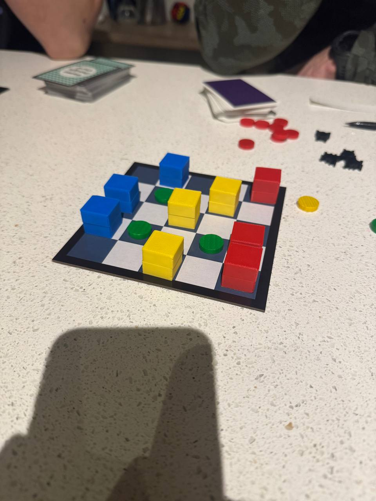
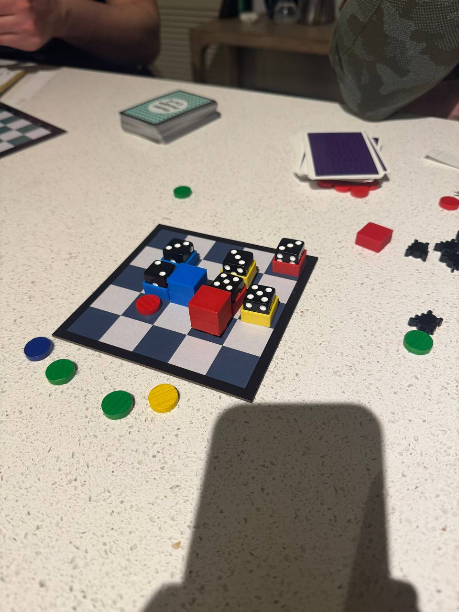
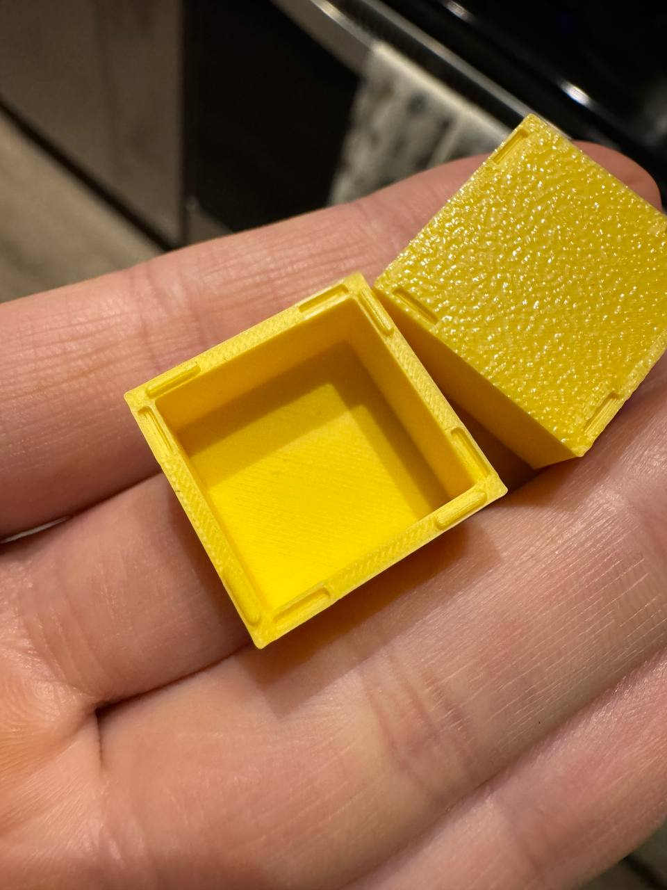
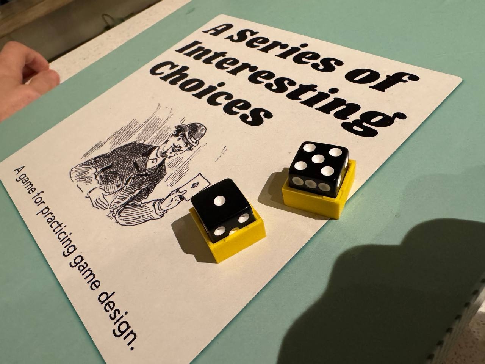
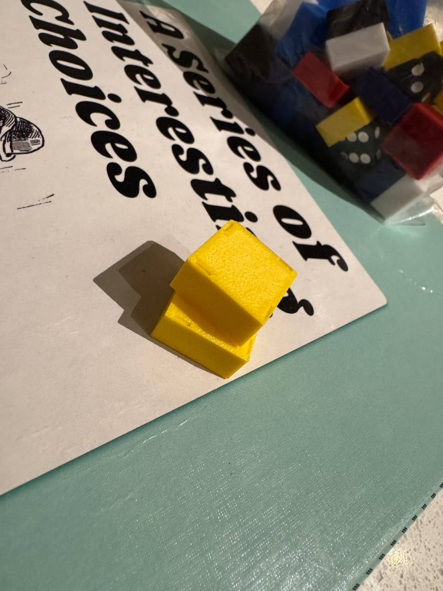

# Versatile Game Tokens
Multi functional dice holding game tokens for designing board games and playing [A Series Of Interesting Choices](https://www.eriksvedang.com/aseriesofinterestingchoices/), which I discovered through the creator Erik Svedang of [Carp Lisp](https://github.com/carp-lang/Carp).

These tokens fit neatly on chess & hex boards. They can:
* Be used face down as individual tokens.
* Be stacked.
* Carry a die.
* 2 tokens can join to conceal the internal state of a die inside.

These tokens have tiny pegs and holes along the top & bottom to allow for easy and robust snapping and stacking. These pegs might require precision from your 3D printer, I used a 0.2mm nozzle. I've included a pegless smooth version that works great with less precise nozzles (such as my 0.4mm nozzle).

I've found you can wring a lot of creative use out of this simple token design for creating varied games! If you've found a token design that enables more versatility, share it under issues!

Here is a game where dice are concealed within joined tokens, with the dice representing a hidden token 'combat power'. These feel quite satisfying to move around.

Later in this game, the top piece of some tokens has been removed to reveal the internal die state.

These are the pegs that make stacking pieces easy and robust.

You can see that these dice fit snuggly but there's no friction when pulling a die out of a token, so it is easy to reconfigure these dice.

Pegs neatly align with holes on both the top & bottom.
